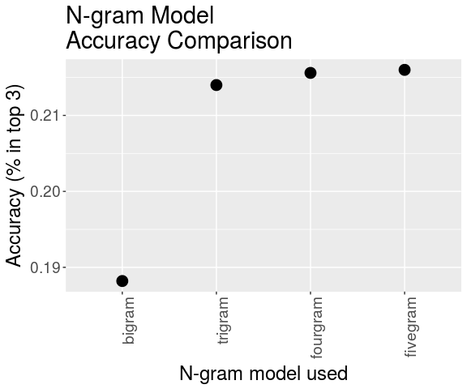

Next Word Prediction
================
Nick Rumbaugh
April 26, 2018

Creating a Next Word Prediction Model
=====================================

<https://github.com/rumbaugh/NextWordPredict>

When you're typing out a text message, it's useful to have the application your using be able to guess what you're trying to type next to speed things up. If one were to type out "That's really", the application would maybe suggest "cool", which is exactly what this is. This type of algorithm is now commonplace in text messaging applications, and is what I will refer to as a Next Word Prediction Model. I have built one myself, and deployed it online as an R Shiny app.

This project was carried out as part of the Data Science Capstone Coursera course taught by Jeff Meek, Roger D. Peng, and Brian Caffo of Johns Hopkins University. The course partners with SwiftKey, a company that builds smart keyboard for typing on mobile devices.

The Data
--------

The corpora were derived from publicly avaiable sources via a web crawler. Entires were checked for their language, and only those tagged as English are included here. The data come from three main sources: blogs, news articles, and Twitter posts. Approximately 50% of each entry was deleted as a means of anonymization. The data can be downloaded [here](https://d396qusza40orc.cloudfront.net/dsscapstone/dataset/Coursera-SwiftKey.zip). Below is a basic summary of it.

|         | Lines (k) | Characters (M) | Char. per Line |
|:--------|:---------:|:--------------:|:--------------:|
| Blogs   |   899.3   |      210.2     |      233.7     |
| News    |   1010.2  |      205.8     |      203.7     |
| Twitter |   2360.1  |      167.1     |      70.8      |
| Total   |   4269.7  |      583.1     |      136.6     |

In total, there are over 4 million entries comprising over 550 million characters. Naturally, the blogs and news articles tend to be longer, especially since Twitter posts were capped at 140 characters. Below are some example entries.

``` r
con1 <- file("example_data/en_US.twitter.txt", "r")
con2 <- file("example_data/en_US.news.txt", "r")
con3 <- file("example_data/en_US.blogs.txt", "r")
tweets <- readLines(con1, n = 5)
news <- readLines(con2, n = 5)
blogs <- readLines(con3, n = 5)
close(con1); close(con2); close(con3)
print(c(tweets, news[4:5], blogs[4:5]))
```

    ## [1] "How are you? Btw thanks for the RT. You gonna be in DC anytime soon? Love to see you. Been way, way too long."                                                                                                                                                                                                                                                                                                                                                                                                                                                                                                                   
    ## [2] "When you meet someone special... you'll know. Your heart will beat more rapidly and you'll smile for no reason."                                                                                                                                                                                                                                                                                                                                                                                                                                                                                                                 
    ## [3] "they've decided its more fun if I don't."                                                                                                                                                                                                                                                                                                                                                                                                                                                                                                                                                                                        
    ## [4] "So Tired D; Played Lazer Tag & Ran A LOT D; Ughh Going To Sleep Like In 5 Minutes ;)"                                                                                                                                                                                                                                                                                                                                                                                                                                                                                                                                            
    ## [5] "Words from a complete stranger! Made my birthday even better :)"                                                                                                                                                                                                                                                                                                                                                                                                                                                                                                                                                                 
    ## [6] "The Alaimo Group of Mount Holly was up for a contract last fall to evaluate and suggest improvements to Trenton Water Works. But campaign finance records released this week show the two employees donated a total of $4,500 to the political action committee (PAC) Partners for Progress in early June. Partners for Progress reported it gave more than $10,000 in both direct and in-kind contributions to Mayor Tony Mack in the two weeks leading up to his victory in the mayoral runoff election June 15."                                                                                                              
    ## [7] "And when it's often difficult to predict a law's impact, legislators should think twice before carrying any bill. Is it absolutely necessary? Is it an issue serious enough to merit their attention? Will it definitely not make the situation worse?"                                                                                                                                                                                                                                                                                                                                                                          
    ## [8] "so anyways, i am going to share some home decor inspiration that i have been storing in my folder on the puter. i have all these amazing images stored away ready to come to life when we get our home."                                                                                                                                                                                                                                                                                                                                                                                                                         
    ## [9] "With graduation season right around the corner, Nancy has whipped up a fun set to help you out with not only your graduation cards and gifts, but any occasion that brings on a change in one's life. I stamped the images in Memento Tuxedo Black and cut them out with circle Nestabilities. I embossed the kraft and red cardstock with TE's new Stars Impressions Plate, which is double sided and gives you 2 fantastic patterns. You can see how to use the Impressions Plates in this tutorial Taylor created. Just one pass through your die cut machine using the Embossing Pad Kit is all you need to do - super easy!"

### Pre-processing

Initial processing of the data was carried out using the *tm* library. For the general analysis, all non-alphabetical characters (except for ') were removed, and the corpus was put into lower-case. Additionally, a separate analysis was done to find the most common words that occured after sentence-ending punctuation (period, question marks, and exclamation points) and after commas, as well as to find which words were contained capitalization a majority of the time.

Building an N-gram Model
------------------------

One of the most prominent methods for next word prediction is to use an N-gram model. An N-gram is just a sequence of N words in a row. The basic idea behind this model is that you count up the occurences of every unique N-gram in some sample data and then use those occurences to construct probability distributions of any given N-gram occuring.

N-gram models benefit from smoothing methods by relating N-gram probabilities with potential (N+1)-grams that complete it. Kneser-Ney smoothing is the most widely used method, to the extent that I found no references to any other smoothing method in my research of best practices.

Kneser-Ney smoothing is defined by the following equations:

$$
p\_{KN}\\left(w\_i|w^{i-1}\_{i-n+1}\\right) = \\frac{{\\rm max}\\left(c\\left(w^{i-1}\_{i-n+1}, w\_i\\right)-\\delta, 0\\right)}{\\Sigma\_{w'}c\\left(w^{i-1}\_{i-n+1}, w'\\right)} + 
\\delta\\frac{|\\{w':0 &lt; c\\left(w^{i-1}\_{i-n+1}, w'\\right)\\}|}{\\Sigma\_{w'}c\\left(w^{i}\_{i-n+1}\\right)}p\_{KN}\\left(w\_i|w^{i-1}\_{i-n+2}\\right)\\\\
p\_{KN}\\left(w\_i\\right) = \\frac{|\\{w':0 &lt; c\\left(w', w\_i\\right)\\}|}{|\\{(w', w''):0 &lt; c\\left(w'', w'\\right)\\}|}=\\frac{{\\rm Number\\ of\\ unique\\ bigrams\\ ending\\ with\\ }w\_i}{{\\rm Number\\ of\\ bigrams}}
$$
 Note: If you are viewing this as a markdown file, the LaTe$\\Chi$ equations can't render. An html file can be found [here](https://rumbaugh.github.io/DataScienceCapstone/).

We are trying to calculate the probability corresponding to a specific sequence of n words, *w*<sub>*i*</sub> (the last word) through *w*<sub>*i* − *n* + 1</sub> (the first word). This is the probability of the last word, given the sequence of n-1 words preceding it. First, you count the number of times the full n-gram occurs in the corpus, subtracting off the discount value *δ* to weight down infrequent ones. You divide this by the number n-grams that start with the corresponding (n-1)-gram. You add to this another term proportional to a recursive Kneser-Ney probability with the first word removed. The equation is recursive down to unigram probabilities, which are just the number of unique bigrams that end with the given word divided by the total number of bigrams. This is meant to give a probability that reflects finding that word in an unfamiliar context.

To actually calculate the probabilities of each N-gram, I started by counting the occurences of each unique N-gram in the corpus. For this task, I used the *tm* and *RWeka* libraries. The corpus, which consists of three files containing the news articles, blogs, and Twitter posts, was loaded into a *tm* VCorpus object and subjected to pre-processing. *RWeka* was used to construct a tokenizer to locate all N-grams of a specific size in the file, and I created a Document Term Matrix, which is an array that contains the number of occurences of each unique N-gram in each input file. For this application, each input file was treated equally and the counts were the sums of the N-gram occurences in the files.

An example for calculated the trigram counts is given below. More detail can be found in the R folder.

``` r
vc <- VCorpus(DirSource(data_dir), readerControl = list(language='lat'))
TrigramTokenizer <- function(x) NGramTokenizer(x, 
         Weka_control(min = 3, max = 3))
vc_trigram_tdm <- DocumentTermMatrix(vc, 
           control = list(wordLengths=c(1, Inf), 
           tokenize = TrigramTokenizer))
trigrams <- colSums(as.matrix(vc_trigram_tdm))
```

After these N-gram counts are calculated, Kneser-Ney smoothing was used to calculate the probabilities of each N-gram.

Creating an N-gram model now means using these probabilities with a backoff model. Given an input n-gram, we want to find the Kneser-Ney smoothed probabilities for all (n+1)-grams that complete that, where the last word is our prediction. If there aren't any, or the probabilities are too low, we will look up the probabilities for the (n-1)-gram formed by throwing out the first letter of our input phrase. We do this recursively until we get an answer, or we throw out the entire input word, in which case we just return the unigrams with the highest probabilities.

The code for my N-gram model can be found in the R folder. Here are some examples of it working in action. Note that the three most probable predictions are returned in each case.

``` r
ngram_model('Welcome to')
```

    ## [1] "the"     "twitter" "my"

``` r
ngram_model('so much for the')
```

    ## [1] "first"  "follow" "RT"

I built some additional features into the model. It recognizing sentence-ending punctuation and commas, and will truncate input strings to only the part after these marks. If there is only white space after the punctuation, the model returns the most common words found at the start of sentences or after commas, respectively:

``` r
ngram_model('Welcome to, ')
```

    ## [1] "and" "but" "the"

``` r
ngram_model('so much for the. ')
```

    ## [1] "I"   "The" "It"

In addition, for each output word, the model checks how it was most commonly capitalized to give more appropriate predictions. For example:

``` r
ngram_model('Pope John')
```

    ## [1] "Paul"   "and"    "McCain"

### N-gram Comparisons

The most important parameter of the model is what the highest order N-grams constructed should be. As N increases, the accuracy of the model should as well, since you are taking more of the preceding words into account. There are, however, diminishing returns, and memory usage increases, as well.

I initially tested the model using N-grams up to 5, and compared the accuracy of these models to ones of lower orders. Testing was carried out on part of the dataset set aside for this purpose. All possible N-grams were created in this test set, and a random sample was chosen for testing. For each N-gram, the first (N-1) words were fed into the model as input, and the predictions were checked against the final word. Since three predictions are given in each case, accuracy was calculated as the percentage of cases where the actual final word was among the three predictions. Below is a plot of these accuracies for N-gram models with orders between 2 and 5.

``` r
ggplot(ngram_var, aes(x=Ngram, y=Accuracy)) + 
    xlab('N-gram model used') + 
    ylab('Accuracy (% in top 3)') +
    ggtitle('N-gram Model\nAccuracy Comparison') +
    geom_point(aes(size=20), show.legend=F) + 
    theme(text = element_text(size=18), 
                         axis.text.x=element_text(angle=90, hjust=1)) 
```



Relatively large gains are made going from the bigram model (meaning just the previous word is used for each prediction) and the trigram model (meaning the previous two words are used for each prediction). Accuracy gains beyond the trigram model are negligible. Since the higher order models require more memory, this suggests it may be better to stick with a bigram or trigram model.

LSTM - Building a Neural Network Model
--------------------------------------

Another prominent method for next word prediction is using recurrant neural networks. I decided to implement one of these (a long short term memory network, or LSTM) to see if it could improve on the N-gram model, using the *keras* library.

When using an LSTM, one of the primary parameters is what features to use. The two obvious options are to use whole words as features (similarly to the N-gram model), or to use individual characters. The latter has several advantages. Foremost, the memory required is orders of magnitude smaller. In the case of words as features, the typical approach would be to take the, say, 20000 most common words in the corpus and encode each word as a vector in this space. On the other hand, the number of possible characters is much smaller, meaning the feature matrix can be made almost 100 times smaller. The main drawback is that less content can be encoded in each row of the feature matrix. There is another advantage in that character-level prediction allows the model to seamlessly made predictions to complete partially typed out words, which is a common application of current next word prediction apps.

Ultimately, I did not spend much time refining the LSTM model, since, as the next section shows, it was inefficient compared to the N-gram model.

Comparing Models
----------------

In choosing between the N-gram and LSTM models, and between different N-gram models, I was interested not just in the accuracy of the models, but in their memory usage and time per prediction. The use case is mobile, so the latter two quantities need to be as low as possible. Time per prediction in particular should be sensitive for users, since it needs to be comparable to typing speed or else the app is not useful.

Below are comparisons for different models I built. Benchmarking was carried out using the [dsci-benchmark](https://github.com/hfoffani/dsci-benchmark) package. Note that the N-gram models were trained using 25% of the dataset, while the LSTM model was trained on under 1% of the dataset.

<table style="width:100%;">
<colgroup>
<col width="16%" />
<col width="27%" />
<col width="31%" />
<col width="24%" />
</colgroup>
<thead>
<tr class="header">
<th align="left"></th>
<th align="center">Time per Prediction (ms)</th>
<th align="center">Prediction Memory Usage (MB)</th>
<th align="center">Accuracy (% in top 3)</th>
</tr>
</thead>
<tbody>
<tr class="odd">
<td align="left">5-gram</td>
<td align="center">210</td>
<td align="center">490</td>
<td align="center">21.6</td>
</tr>
<tr class="even">
<td align="left">Trigram</td>
<td align="center">160</td>
<td align="center">300</td>
<td align="center">21.4</td>
</tr>
<tr class="odd">
<td align="left">Trigram (opt.)</td>
<td align="center">25</td>
<td align="center">14</td>
<td align="center">20.5</td>
</tr>
<tr class="even">
<td align="left">LSTM</td>
<td align="center">2100</td>
<td align="center">210</td>
<td align="center">13.0</td>
</tr>
</tbody>
</table>

The most important conclusion from this comparison is how slow the LSTM model is in comparison to the N-gram models. It is 10 times slower than even the 5-gram model. On top of that, I was able to create an even more efficient trigram modelby making some concesions such as dropping N-grams that occured 10 times or fewer and, for every unigram or bigram, only keeping the top three most probably bigrams or trigrams, respectively, that complete it. This model was almost 100 times faster than the LSTM model, with under 10% of the memory usage.

While it may be possible to construct a more efficient LSTM model, the inherent disadvantage this table suggests, along with the significantly longer training time, mean it is not the most appropriate model for the use case.

The optimized trigram model was the one I chose to deploy. The small time per prediction, on the order of tens of milliseconds, and memory usage mean it can be deployed efficiently even on older phones. Testing of the final product on an iPhone 6S (2GB RAM) demonstrated no noticeable lags.

Final Product
-------------

The final product is an R Shiny app that uses the optimized trigram model to make predictions based on typed input. The app is available [here](https://rumbaugh.shinyapps.io/NextWordPredict). Simply type a sentence into the text box and the top 3 predictions will be given in buttons below. Click on a button to insert that word at the end of your text in the box.
